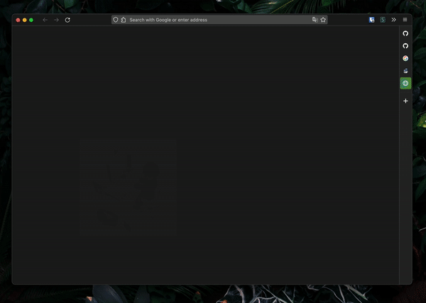
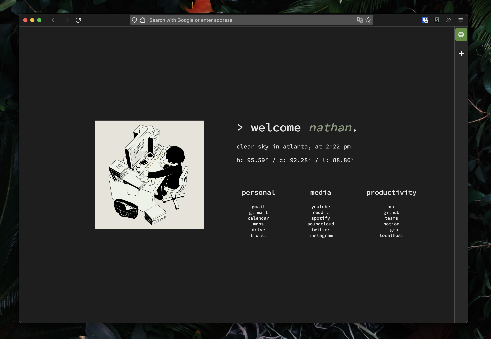
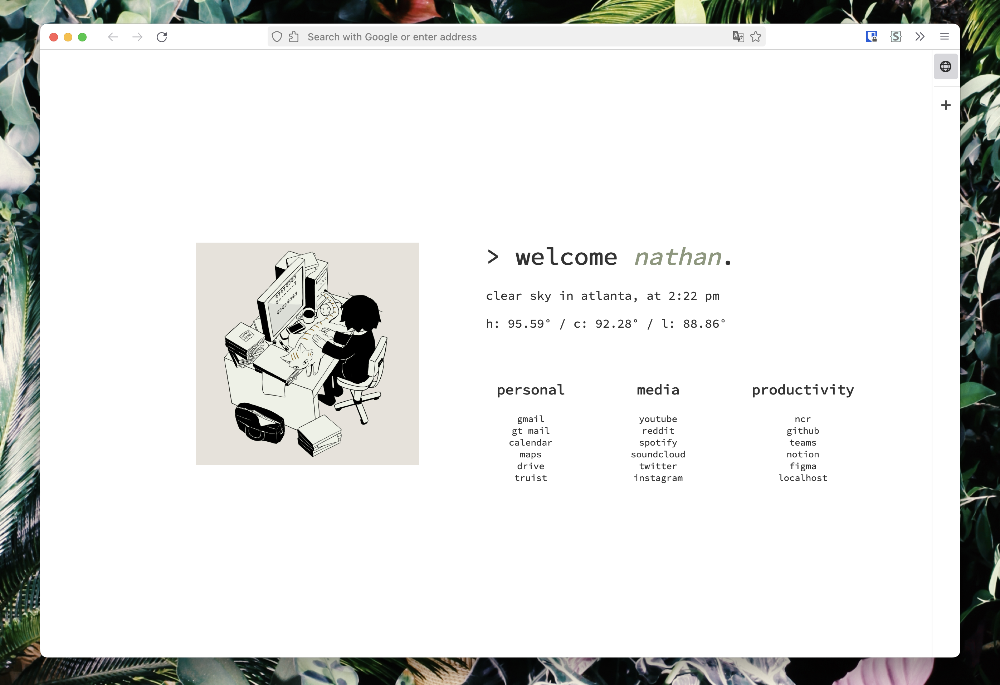

# My custom startpage and Firefox CSS theme

Merging the projects of [Tilde](https://github.com/nathandaven/tilde) and [startpage](https://github.com/nathandaven/startpage) forked into one. Shout out to the original creators of both!

This repository includes my API key. The API key is attached to a dummy account, however please refrain from using it. This repo is made specifically for my use case, but feel free to use this as a base if interested. Please change the API key by following the documentation here: https://github.com/nathandaven/startpage.

Firefox extension is compiled and signed using web-ext. Please read the documentation on web-ext if you are interested in creating and signing your own version of this project.

## Credits

Complete credit goes to these developers and their sources:

Searching mechanism: 
https://github.com/nathandaven/tilde

General design:
https://github.com/nathandaven/startpage

Focus content on newtab script:
https://github.com/gdh1995/vimium-c-helpers/blob/master/newtab/newtab.js

My custom Firefox userChrome.css based on this [project](https://github.com/ranmaru22/firefox-vertical-tabs):  
https://gist.github.com/nathandaven/67f293758f13971882adf334b66db8ed

My Tab Centern Reborn custom css config: https://gist.github.com/nathandaven/93f52bdc881a6e7cc621e097404b0d01

## Screenshots

